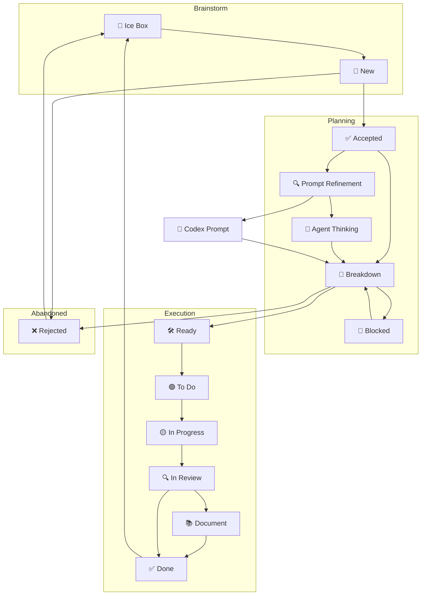

# Board flow

## 🌐 Updated Kanban Flow Diagram

## 🧭 Stage Descriptions

### Ice Box

Raw ideas, incomplete thoughts, or unclear goals. May never move forward without refinement.

### New

A lightly-formed idea or proposal. We are not yet committed to doing it.

**Transitions:**

* `New -> Accepted`: we've discussed and decided it has value.
* `New -> Rejected`: it's a duplicate, not feasible, or not relevant.

### Rejected

Explicitly considered and shelved ideas. Archived but remembered.

### Accepted

An idea we've acknowledged as worth exploring. Still needs structure.

**Must go through `Breakdown` before work can begin.**

### Prompt Refinement

Used for refining fuzzy ideas into clear prompts or specs.
The human and the agent collaborate here to shape rough thoughts into actionable items.
The agent can suggest required files or tests and highlight missing details.

### Agent Thinking

Exploration space for free-form dialogue with the AI agent.
The agent surfaces risks, proposes sub‑tasks, and explores implementation options.
Items from here usually return to **Breakdown** once concrete actions emerge.

### Breakdown

We break the idea down into requirements, values, and approaches.
Outcomes:

* Becomes `Ready`
* Moves to `Blocked`
* Gets `Rejected`

### Blocked

Work was promising but halted due to dependencies, design holes, or undefined scope.

### Ready

We understand the task and could start it anytime. Not yet prioritized.

### To Do

Prioritized tasks queued for action.

### In Progress

Actively being worked on.

### In Review

Awaiting human or agent confirmation, test passes, or spec matching.

### Document

Needs written `AGENT.md`, docstrings, or Markdown notes.

### Done

Confirmed complete and aligned with system.

## 🤖 Agent Collaboration

A board manager agent keeps this flow consistent.

- When ideas appear in **New** or **Accepted**, the agent can create task stubs in `agile/tasks/`.
- During **Prompt Refinement** and **Agent Thinking**, it records decisions and links related tasks.
- The agent verifies that each item has clear requirements before moving from **Breakdown** to **Ready**.
- It may shift cards automatically when commits or documentation satisfy stage requirements.
- Before marking **Done**, the agent checks that docs exist and links to code or artifacts are attached.

The human contributor has final say on priorities and merges, but the agent maintains board hygiene and surfaces gaps.

Codex and the board manager agent participate throughout this flow. The board
manager keeps tasks synced between the Kanban board and `agile/tasks/`, while
Codex provides code or documentation when a card carries the `#codex-task` tag.
During **Prompt Refinement** and **Agent Thinking**, the user and the agent talk
through rough ideas until they can be broken down into actionable work. The agent
suggests board movements based on metadata and helps enforce WIP limits.

---

## 🏷 Tags

* `#codex-task` → Codex should code/test/doc
* `#agent-mode` → Discussion-style exploration
* `#framework-core` → Related to Promethean internals
* `#agent-specific` → Tied to a named agent (e.g., Duck, Synthesis)
* `#layer1`, `#layer2` → Tied to Eidolon/Cephalon layers
* `#doc-this` → Task produces documentation
* `#rewrite-later` → Placeholder

---

This kanban is intended to reflect the needs of a distributed hybrid development model: you, agent-mode, Duck, and Codex all work together across asynchronous phases.

#agile #workflow #codex #agent-mode #promethean
