# Board flow

## 🌐 Updated Kanban Flow Diagram

```mermaid
flowchart TD

    subgraph Brainstorm
        IceBox["🧊 Ice Box"]
        New["💭 New"]
    end

    subgraph Planning
        Accepted["✅ Accepted"]
        Breakdown["🧩 Breakdown"]
        PromptRefine["🔍 Prompt Refinement"]
        AgentThinking["🤔 Agent Thinking"]
        Blocked["🚧 Blocked"]
    end

    subgraph Execution
        Ready["🛠 Ready"]
        Todo["🟢 To Do"]
        InProgress["🟡 In Progress"]
        InReview["🔍 In Review"]
        Document["📚 Document"]
        Done["✅ Done"]
    end

    subgraph Abandoned
        Rejected["❌ Rejected"]
    end

    IceBox --> New
    New --> Accepted
    New --> Rejected
    Accepted --> Breakdown
    Breakdown --> Ready
    Breakdown --> Blocked
    Breakdown --> Rejected

    Accepted --> PromptRefine
    PromptRefine --> CodexPrompt["🤖 Codex Prompt"]
    PromptRefine --> AgentThinking
    AgentThinking --> Breakdown
    CodexPrompt --> Breakdown

    Ready --> Todo
    Todo --> InProgress
    InProgress --> InReview
    InReview --> Document
    Document --> Done
    InReview --> Done

    Done --> IceBox
    Blocked --> Breakdown
    Rejected --> IceBox
```

## 🧭 Stage Descriptions

### Ice Box

Raw ideas, incomplete thoughts, or unclear goals. May never move forward without refinement.

### New

A lightly-formed idea or proposal. We are not yet committed to doing it.

**Transitions:**

* `New -> Accepted`: we've discussed and decided it has value.
* `New -> Rejected`: it's a duplicate, not feasible, or not relevant.

### Rejected

Explicitly considered and shelved ideas. Archived but remembered.

### Accepted

An idea we've acknowledged as worth exploring. Still needs structure.

**Must go through `Breakdown` before work can begin.**

### Prompt Refinement

Used for refining fuzzy ideas into clear prompts or specs, often for Codex or Agent mode.

### Agent Thinking

Exploration space for agent-mode and collaborative AI discussions.
These are not implementation-ready.

### Breakdown

We break the idea down into requirements, values, and approaches.
Outcomes:

* Becomes `Ready`
* Moves to `Blocked`
* Gets `Rejected`

### Blocked

Work was promising but halted due to dependencies, design holes, or undefined scope.

### Ready

We understand the task and could start it anytime. Not yet prioritized.

### To Do

Prioritized tasks queued for action.

### In Progress

Actively being worked on.

### In Review

Awaiting human or agent confirmation, test passes, or spec matching.

### Document

Needs written `AGENT.md`, docstrings, or Markdown notes.

### Done

Confirmed complete and aligned with system.

---

## 🏷 Tags

* `#codex-task` → Codex should code/test/doc
* `#agent-mode` → Discussion-style exploration
* `#framework-core` → Related to Promethean internals
* `#agent-specific` → Tied to a named agent (e.g., Duck, Synthesis)
* `#layer1`, `#layer2` → Tied to Eidolon/Cephalon layers
* `#doc-this` → Task produces documentation
* `#rewrite-later` → Placeholder

---

This kanban is intended to reflect the needs of a distributed hybrid development model: you, agent-mode, Duck, and Codex all work together across asynchronous phases.

#agile #workflow #codex #agent-mode #promethean
