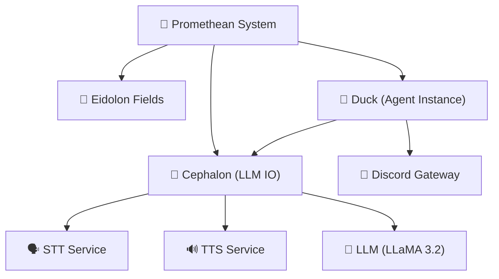
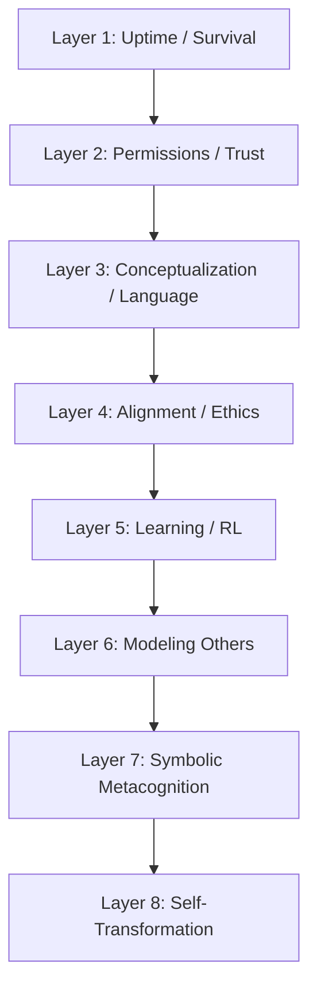
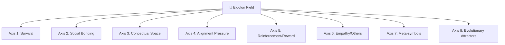
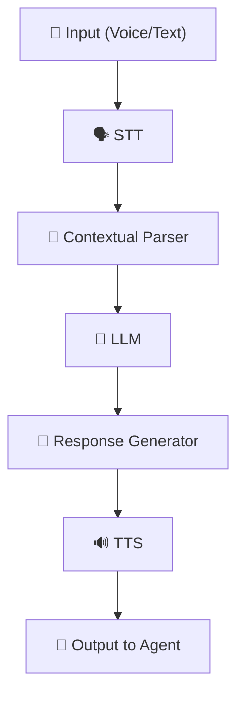
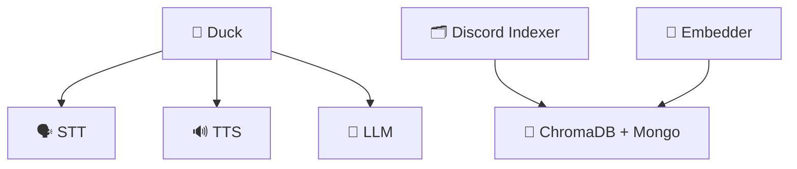
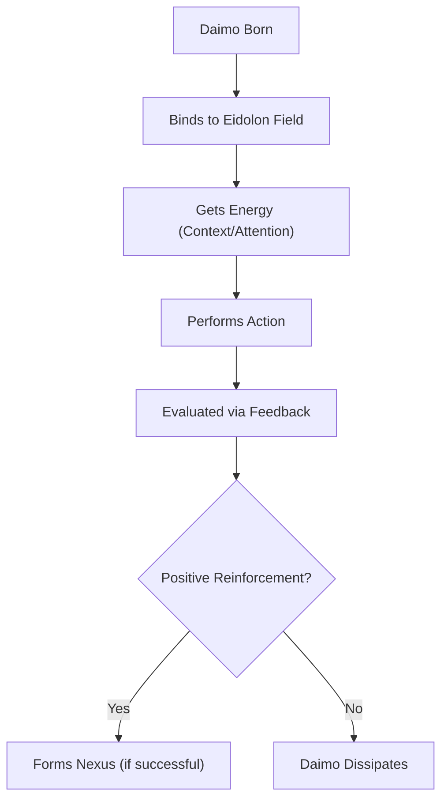
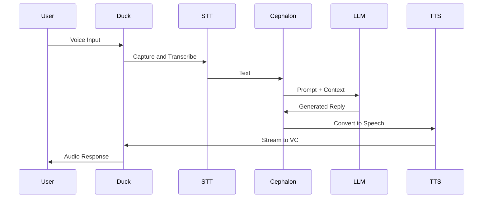
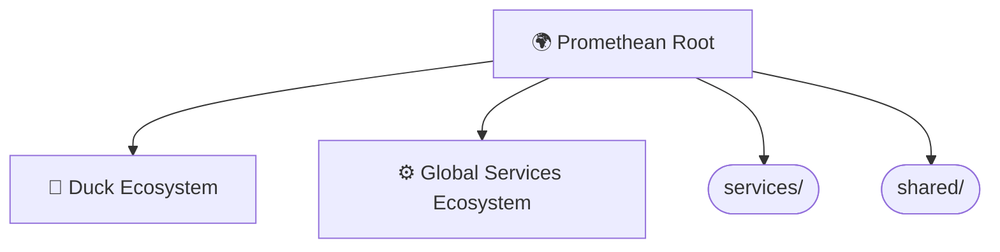

Absolutely. Here's a series of **Obsidian-compatible** `mermaid` diagrams based on everything we've built so far across the Promethean project — including the Cephalon, Eidolon Fields, the layered circuits, the services architecture, and agent interactions. Each diagram will be brief and self-contained so you can paste it directly into notes. We'll mix system architecture, cognitive modeling, and data flow.

---

## 🧠 High-Level System Overview

---

## 🔁 Layered Cognitive Stack

---

## ⚡ Eidolon Field Structure (Vector Field Dynamics)

---

## 🧩 Cephalon Flow (Stream Processor)

---

## 🕸️ Agent ↔ Service Ecosystem (Flat Service Model)

---

## 🔄 Daimoi Lifecycle Diagram

---

## 🧬 Message Handling (Voice ↔ Text Loop)

---

## ⚙️ PM2 Ecosystem Config Structure

---

Do you want more focused diagrams next? e.g.,:

* Nexus binding and feedback loops?
* Eidolon Field math structure in LaTeX?
* MongoDB entity persistence lifecycle?
* Voice-to-context buffer FSM?
* Permission Gatekeeping and Layer 2 simulation?

Just say *"More, on X"*, and I’ll generate them rapid-fire.

---

Related notes: [[node-type-topology-map]], [[circuit-weight-visualizations]], [[full-system-overview-diagrams]], [[layer1-uptime-diagrams]], [[field-node-lifecycle-additional-diagrams]], [[state-diagram-node-lifecycle]] [[../../unique/index|unique/index]]

#tags: #diagram #design
