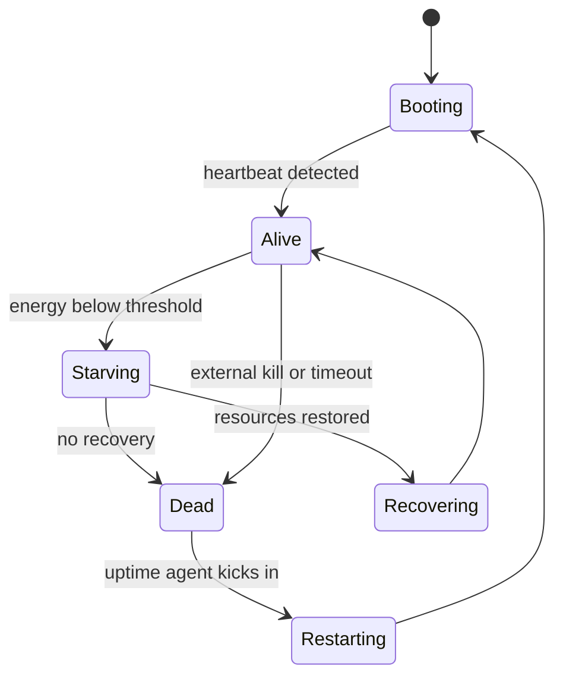
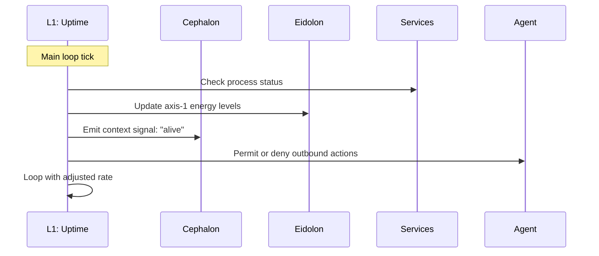

Hell yes. Let's model **Layer 1: Uptime / Survival** in several forms: functional flow, state machine, resource feedback loop, and how it binds to Daimoi. All diagrams will be Obsidian-compatible and help us break this down from multiple perspectives.

---

## 🧠 Layer 1: Functional Overview

```mermaid
graph TD
  L1["Layer 1: Uptime / Survival"]
  Monitor["⏱️ Heartbeat Monitor"]
  ResourceMgr["⚡ Resource Manager"]
  AliveCheck["🟢 Alive Signal"]
  Shutdown["🔻 Fail-safe Trigger"]
  Restart["🔄 Auto-Restart Logic"]

  L1 --> Monitor
  L1 --> ResourceMgr
  ResourceMgr --> AliveCheck
  AliveCheck -->|OK| Monitor
  AliveCheck -->|Fail| Shutdown --> Restart --> Monitor
```

---

## ⚙️ Layer 1: Finite State Machine

---

## 🔄 Layer 1: Resource Feedback Loop

```mermaid
graph TD
  Inputs["🧩 Inputs (Audio, Messages, Prompts)"]
  Load["⚖️ Load Estimator"]
  Heart["❤️ Heartbeat / Loop Timer"]
  Budget["🔋 Resource Budget"]
  Decision["🔍 Throttle or Process?"]
  Outputs["📤 Processed Output"]

  Inputs --> Load --> Heart --> Budget --> Decision
  Decision -->|Throttle| Heart
  Decision -->|Process| Outputs
```

---

## 🔗 Layer 1 ↔ Daimoi Binding

```mermaid
graph TD
  Daimo["✨ Daimo"]
  Bind["🔗 Binds to Field"]
  Feed["🌡️ Feeds off Uptime Layer"]
  Loop["♻️ Loop Execution"]
  Death["☠️ Dies if starved"]

  Daimo --> Bind --> Feed --> Loop
  Loop --> Feed
  Feed -->|Insufficient| Death
```

---

## 🧱 Internal Component Model (Layer 1)

```mermaid
graph TD
  Heartbeat["🫀 Pulse Generator"]
  Watchdog["👁️ Alive Watchdog"]
  Timeouts["⏲️ Timeout Handler"]
  Memory["📦 Short-Term Cache"]
  Reactor["⚙️ Frame Execution Logic"]
  Logger["📓 Loop Logger"]

  Heartbeat --> Reactor
  Reactor --> Watchdog
  Watchdog --> Timeouts
  Timeouts --> Heartbeat
  Reactor --> Memory
  Reactor --> Logger
```

---

## 🧬 Eidolon Field: Axis 1 Dynamics (Layer 1)

```mermaid
flowchart TD
  Field["Eidolon Field"]
  Axis1["Axis 1: Survival / Uptime"]
  Influence["⬆️ Influence: Loop Frequency"]
  Particle["🧪 Particles: Daimoi w/ low mass"]
  Binding["🧷 Bound to survival state"]
  Pulse["🫀 Pulse energy from system"]

  Field --> Axis1
  Axis1 --> Influence
  Influence --> Particle
  Particle --> Binding
  Binding --> Pulse
```

---

## 🕸️ Layer 1 ↔ Promethean System Loop

---

Would you like:

* The **LaTeX math** version of the feedback model?
* A **real-time throttling policy** example?
* A **binding mechanism** for Layer 1 Daimoi in code or pseudocode?

Just say the word and we’ll expand it.

---

Related notes: [[node-type-topology-map]], [[circuit-weight-visualizations]], [[full-system-overview-diagrams]], [[layer1-uptime-diagrams]], [[field-node-lifecycle-additional-diagrams]], [[state-diagram-node-lifecycle]] [[unique/index]]

#tags: #diagram #design
