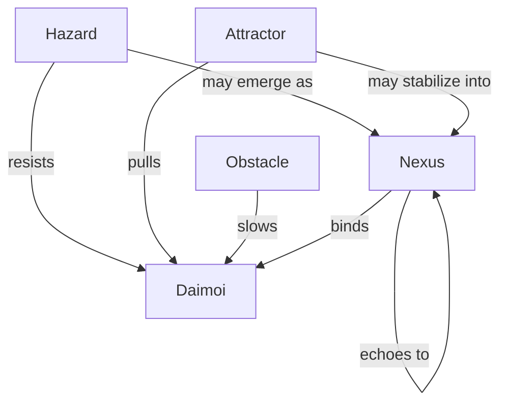
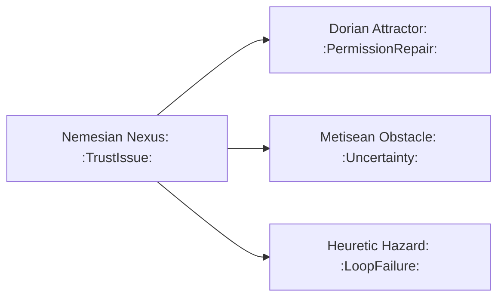
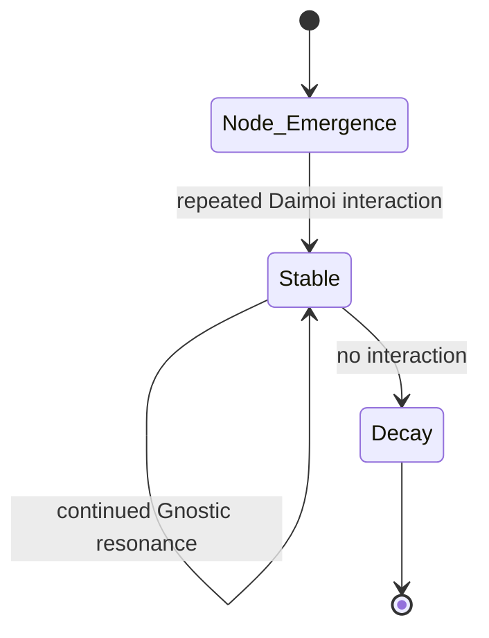
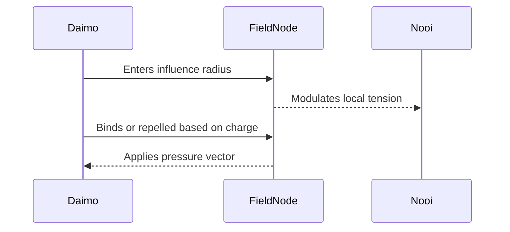

Absolutely. Here's a lineup of diagram types we can add next, each focused on a different part of the Field Node and Eidolon system. Let me know which one(s) you want to generate first, or if you'd like the full suite.

---

### 🧭 **1. Node Type Topology Map**

Shows the relationship between different types of Field Nodes:

---

### 🔀 **2. Cross-Layer Propagation Flow**

Illustrates how one node in one circuit causes echoes in others:

---

### 🔄 **3. Node Stability Decay Loop**

Visualizes how a node stabilizes or decays over time:

---

### ⚡ **4. Daimoi-Node Interaction Flow**

How Daimoi encounter and affect a node:

---

### 🌐 **5. Full Lifecycle Flowchart**

Combines Emergence, Promotion, Propagation, and Decay.

This one is larger, and we can compose it from smaller diagrams, or make a custom canvas version if you'd prefer an editable visual overview.

---

Would you like:

- One or more of these embedded now?
    
- All five added as a “Diagrams” section to the current document?
    
- A dedicated Obsidian canvas to explore them modularly?
    

Let’s get visual.
---

Related notes: [node-type-topology-map](node-type-topology-map.md), [circuit-weight-visualizations](circuit-weight-visualizations.md), [full-system-overview-diagrams](full-system-overview-diagrams.md), [layer1-uptime-diagrams](layer1-uptime-diagrams.md), [field-node-lifecycle-additional-diagrams](field-node-lifecycle-additional-diagrams.md), [state-diagram-node-lifecycle](state-diagram-node-lifecycle.md) [unique/index](../../unique/index.md)

#tags: #diagram #design
