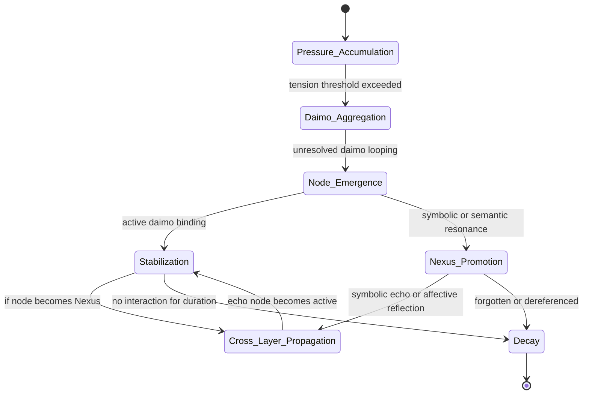

#hashtags: #diagram #eidolon #promethean

---

Related notes: [node-type-topology-map](node-type-topology-map.md), [circuit-weight-visualizations](circuit-weight-visualizations.md), [full-system-overview-diagrams](full-system-overview-diagrams.md), [layer1-uptime-diagrams](layer1-uptime-diagrams.md), [field-node-lifecycle-additional-diagrams](field-node-lifecycle-additional-diagrams.md), [state-diagram-node-lifecycle](state-diagram-node-lifecycle.md) [unique/index](../../unique/index.md)

#tags: #diagram #design
