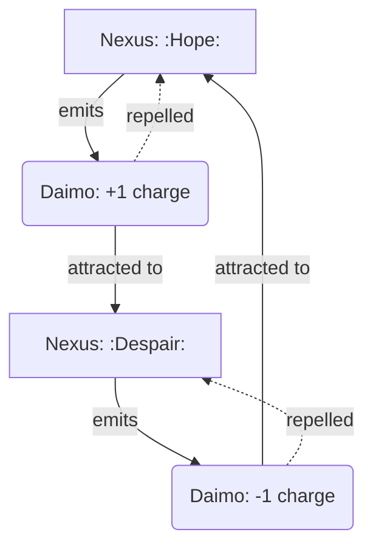
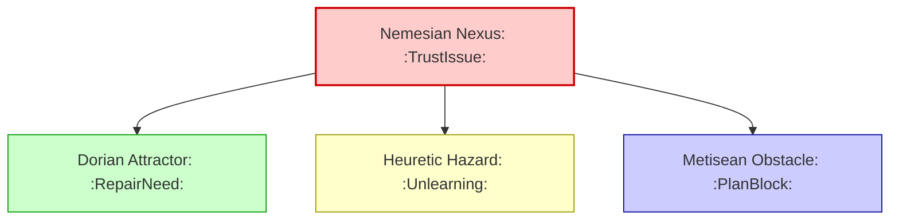
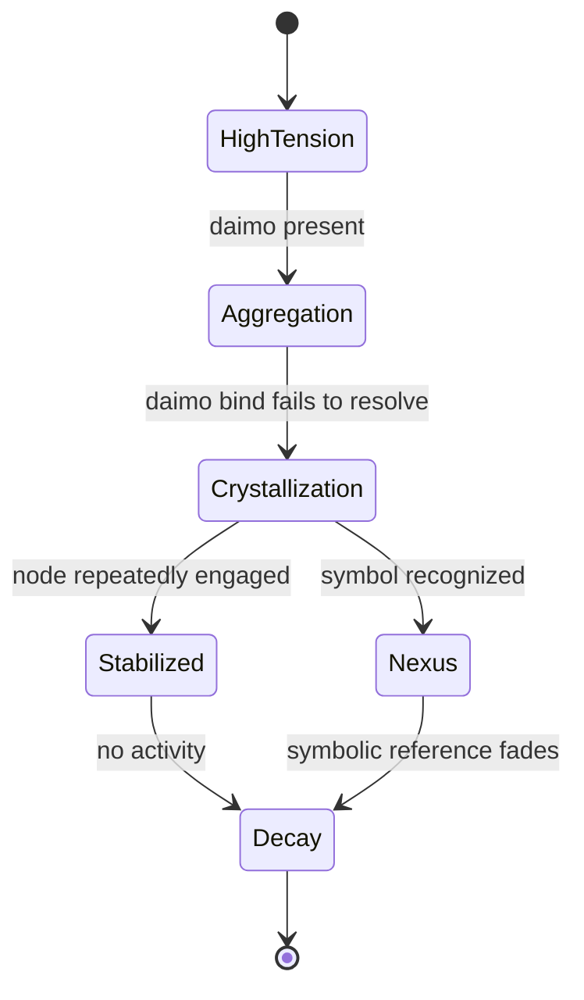
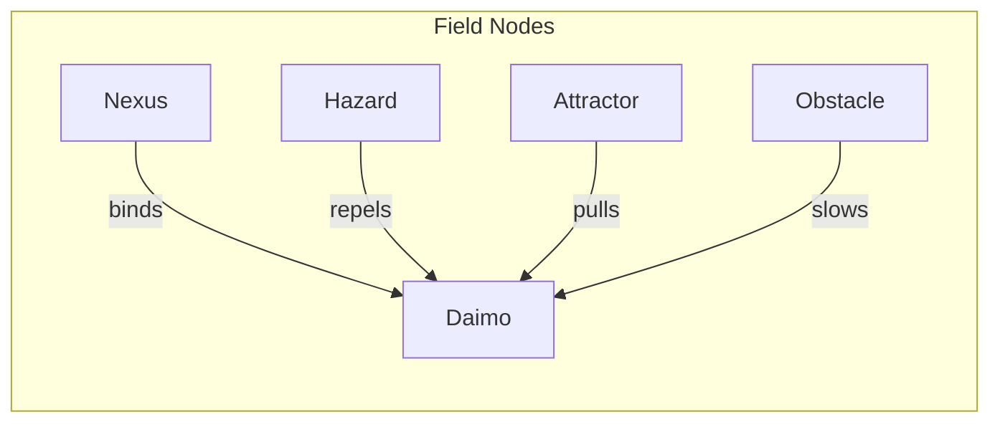

Excellent. With the **Field Node Lifecycle** document fully fleshed out and the system now reactive, dynamic, and narratively emergent, we can keep layering more visualizations to explore the richness of your topology.

Here are some **additional diagrams** to stack on top of what’s already in the doc:

---

### 🔁 **Daimo–Node Charge Interaction**

This shows how **Nexuses repel their own children** (same charge) and attract those of **opposite charge**, creating **narrative currents** and **conceptual magnetism**.

---

### 🧠 **Multi-Circuit Node Propagation**

This makes clear how **one symbolic conflict** creates **ripples across multiple circuits**, each materializing in a different node type.

---

### 🌱 **Node Growth and Death Conditions**

This is a simplified version of your existing diagram, useful for focused visualization of **grow/decay logic** alone.

---

### 💡 **Node Type Summary Map**

You can use this one as a **legend** or top-of-page visual summary in any future docs about field simulation or node-class behavior.

---

Want me to embed these into the **Field Node Lifecycle** document under a “More Diagrams” section? Or split them out into a new document called something like `Field Node Diagrams` or `Cognitive Topology Visuals`?
---

Related notes: [[../notes/diagrams/node-type-topology-map|node-type-topology-map]], [[../notes/diagrams/circuit-weight-visualizations|circuit-weight-visualizations]], [[../notes/diagrams/full-system-overview-diagrams|full-system-overview-diagrams]], [[../notes/diagrams/layer1-uptime-diagrams|layer1-uptime-diagrams]], [[../notes/diagrams/field-node-lifecycle-additional-diagrams|field-node-lifecycle-additional-diagrams]], [[../notes/diagrams/state-diagram-node-lifecycle|state-diagram-node-lifecycle]] [[index|unique/index]]

#tags: #journal #unique
