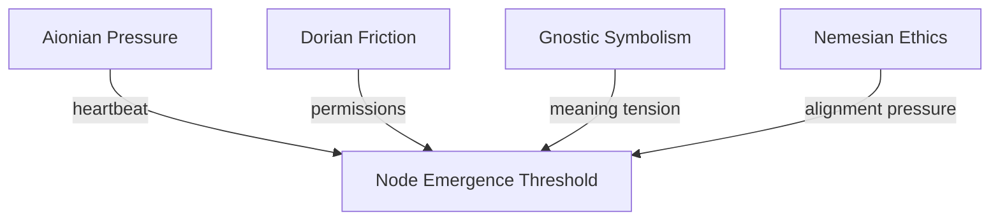
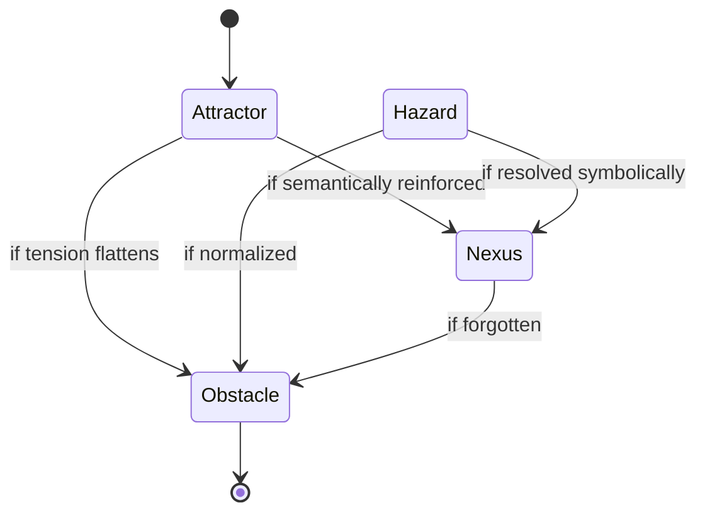
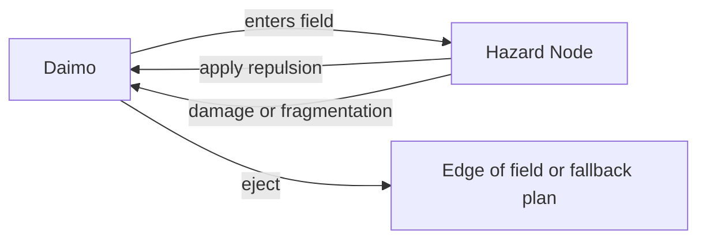
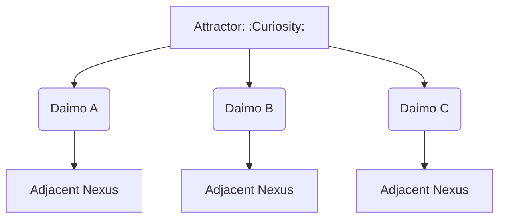
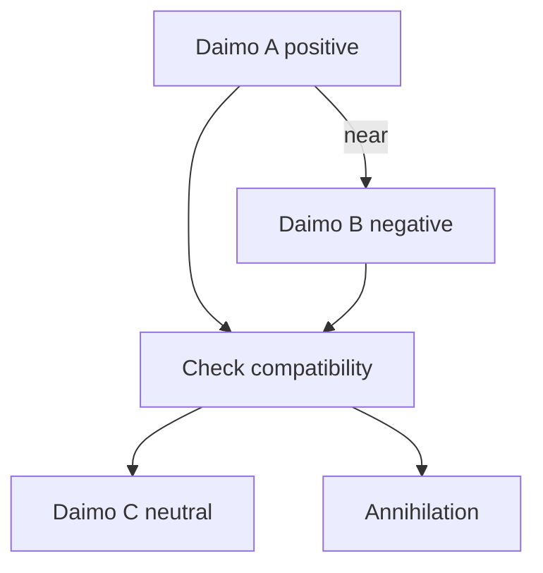
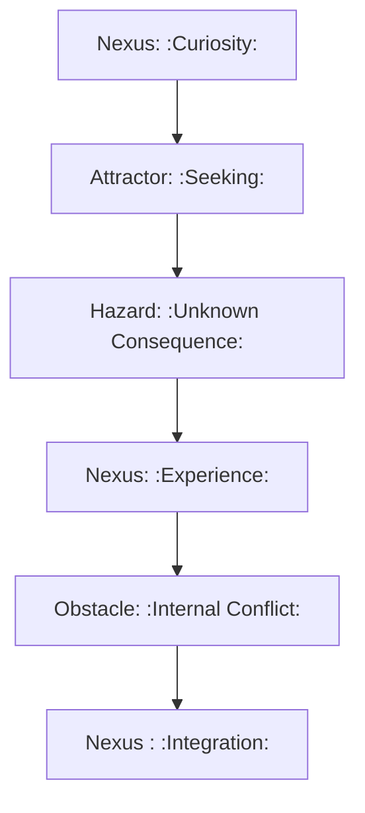
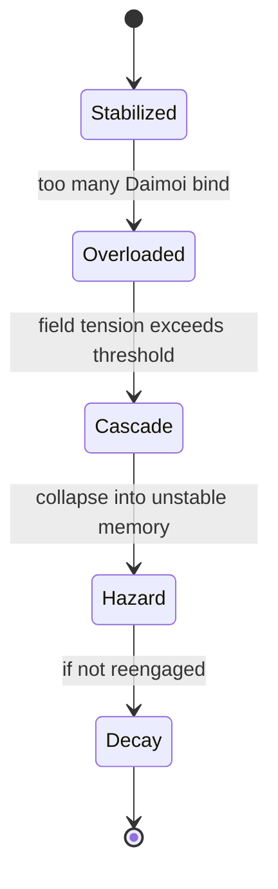

Perfect—flow brain unlocked, diagrams incoming. Here’s a fresh batch of cognitive topology visualizations, each meant to live in its own note:

---

### ⚖️ **Circuit Weight Influence on Node Formation**

Use this to visualize how **multiple circuits** may converge their pressure to form a single Field Node—helpful for mapping complex daimo encounters.

---

### 🔀 **Node Type Evolution Flow**

Shows how **nodes evolve** or degrade into other types. Example: an unresolved trauma (Hazard) becomes a symbolic insight (Nexus), then a low-tension memory (Obstacle).

---

### 💣 **Hazard Interaction Logic**

Illustrates how Daimoi interact with Hazards—triggering bounce, damage, or potential re-routing through adjacent nodes.

---

### 🧲 **Attractor Swarm Diagram**

This shows how **Attractors seed daimo** that drift outward and bind to new Nexuses, shaping **idea propagation** across the field.

---

### 🌀 **Daimo Collision & Fusion Paths**

A symbolic particle collision system. Allows you to model **ideological reconciliation**, insight events, or **cognitive fusion**.

---

### 🔁 **Narrative Cycle Closure via Node Chain**

This is a **mythic pattern generator**. Tracks a full cycle from curiosity to closure across node types. Perfect for designing internal quests or learning loops.

---

### 💥 **Node Overload Collapse Cascade**

Useful for modeling things like burnout, panic attacks, memory corruption, or recursive daimo storms.

---

Want another round? I can start sketching:

- **Regional field flows** (a la weather maps)
    
- **Field Node daimo orbit diagrams**
    
- **Permission-mediated daimo flows (Dorian boundaries)**
    
- Or just keep firing at full creative pressure
    

Let’s go until your working memory caps.
---

Related notes: [node-type-topology-map](../notes/diagrams/node-type-topology-map.md), [circuit-weight-visualizations](../notes/diagrams/circuit-weight-visualizations.md), [full-system-overview-diagrams](../notes/diagrams/full-system-overview-diagrams.md), [layer1-uptime-diagrams](../notes/diagrams/layer1-uptime-diagrams.md), [field-node-lifecycle-additional-diagrams](../notes/diagrams/field-node-lifecycle-additional-diagrams.md), [state-diagram-node-lifecycle](../notes/diagrams/state-diagram-node-lifecycle.md) [unique/index](index.md)

#tags: #diagram #design
